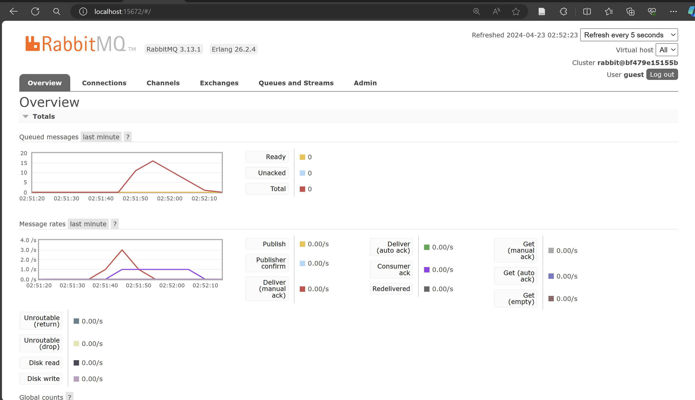
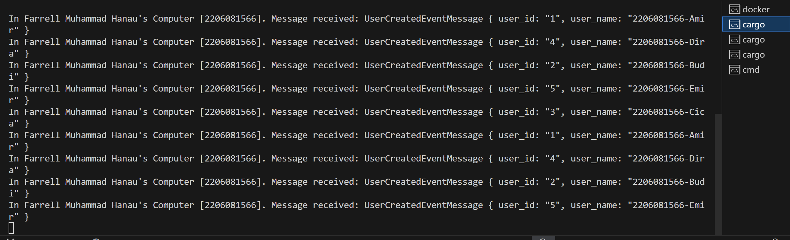
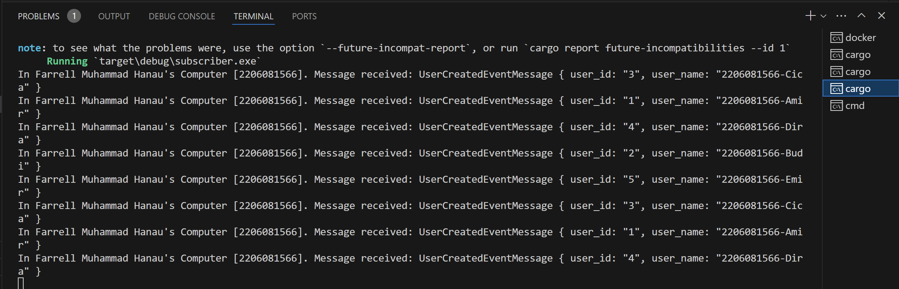
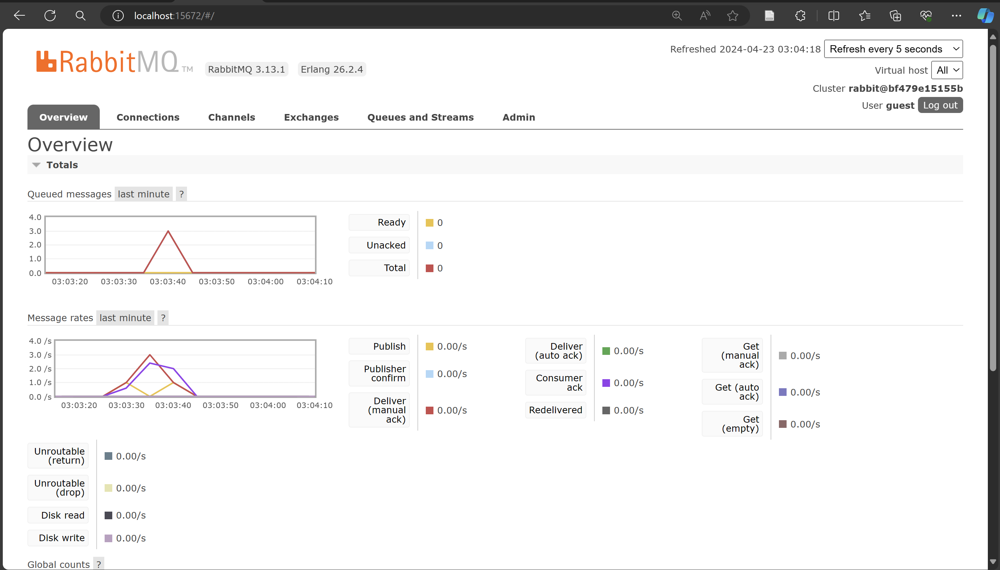

# Tutorial 8

1.  what is AMQP?  
    AMQP atau Advanced Message Queuing Protocol adalah suatu protocol yang berfungsi untuk mengirimkan suatu data atau pesan antar sistem yang berbeda. Dalam rust, AMQP memungkinkan suatu service untuk mengirimkan request/command/event secara asinkronus pada service berbeda sehingga pengirim tidak harus menunggu respons dari penerima dimana pesan-pesan tersebut akan disimpan dalam suatu queue atau antrian. 

2.  what it means? guest:guest@localhost:5672 , what is the first quest, and what is 
the second guest, and what is localhost:5672 is for?  
    guest pertama merujuk pada username yang akan digunakan untuk autentikasi pada AMQP dan merupakan username default. Sementara itu, guest kedua merujuk pada password dari username guest pertama tersebut. localhost merujuk pada hostname server dari AMQP, yang dimana localhost merujuk pada server lokal. Sementara itu, 5672 merujuk pada port dari server localhost tersebut. 

## Simulate slow subscriber

Dari gambar diatas terdapat kira-kira maksimal 17 queue dalam suatu waktu dimana saya menjalankan publisher sebanyak 5 kali atau mengirim sekitar 25 message dalam waktu yang cukup singkat. Banyak queue tersebut diakibatkan saat saya menjalankan publisher berkali-kali, message akan ditampung di queue, namun terdapat delay pada subscriber untuk menerima dan memproses message tersebut. Hal ini mengakibatkan beberapa message tersebut tertampung pada queue untuk beberapa saat yang mengakibatkan grafik tersebut menaik saat proses penjalanan publisher.

## 3 Subscriber

Dari gambar diatas, terdapat kira-kira maksimal 3 queue dalam suatu waktu dimana saya menjalankan publisher sebanyak 5 kali atau mengirimm sekitar 25 message. Hal ini jauh lebih sedikit dari sebelumnya yang hanya menggunakan 1 subscriber dengan maksimal 17 queue. Hal ini dapat terjadi karena message tersebut diterima dan diproses secara paralel oleh beberapa subscriber sehingga lebih cepat untuk message-message tersebut diproses.